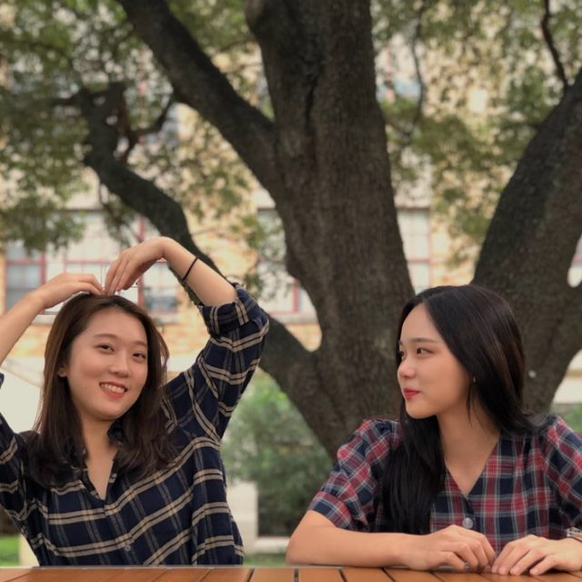

<PageDescription>

Inyoung and Eon 최인영 & 이온

</PageDescription>

<Tabs>

<Tab label="한국어">

<b>소개</b>
 
 
Q: 
<i>
  이름, 학년, 전공
</i>

A: 

  4학년 이유진 (이온), Advertising

 
 

  4학년 최인영, Advertising/RTF

 
 

<b>질문</b>

Q: 
<i>
  어디서 어떻게 만났는지?
</i>

  A: (둘다) UTCAP 프로그램으로 UT Arlington 도서관에서 처음 만났지. 

  내가 같이 수업 듣던 친구가 유진이를 알아서 같은 한국인이여서 만나게 됐지

 
 

Q: 
<i>
  서로에 대해서 좋아하는게 무엇인지?
</i>

A: 

  서로에 대해서 좋아하는 것… 깊게 생각해보자… 

  난 되게 차분한거! 내가 너무 업 되어 있을 때 나를 눌러주는 친구..? 약간 “야…
  진정해…” 이런 역할? 난 그 점이 제일 좋은 것 같애 히히

  난
  
    {" "}
    오히려 얘가 똥꼬발랄하니까 같이 업 되는게 좋거든. 근데 중요한 순간에는
    차분할 줄 아는 친구라서 좋아. 너무 똥꼬발랄 하기만 하면 내가 감당이 안 되서…
    근데 감당이 되는 친구라 ㅎㅎ
  

 
 

Q: 
<i>
  
    자신이 갖고 싶은 상대방의 성격이 있다면 무엇인지?
  
</i>

A: 

  어떤 상황에서 되게 침착한 것. 

  나는… 처음 만난 사람한테 친절하게 잘 다가가는 성격 

 
 

Q: 
<i>
  
    서로에게 주거나 받은 가장 기억에 남는 선물은?
  
</i>

A: 

  나 있어! 많이 친해지지 않았을 때 과자모자를 받은 적이 있어!{" "}

  (근데 인영이가 굉장히 싫어했어…)

  {" "}
  과자로 만든 모자인데… 나는 과자는 그렇다 치는데 왜 메추리알을 위에 올렸는지
  이해가 안 갔어 허헛… 그리고 뜯을때 되게 힘들었어. 근데 그 과자 쉬지 않고
  끝까지 계속 먹었던 기억이 있어 왜냐하면 난 그런 선물을 받아본 적이 없거든

. → 

  사실 도현이랑 이거 만들면서 “와 아이디어 대박이다! 이거 진짜 좋아하겠다!”
  이랬는데 아니였어

  그래서 어떻게 반응을 해야 할 지 몰랐어

  되게 센스있다 생각했던 선물이 있어! 이번에 인영이가 한국 갔을 때 내 생일선물로
  장식용 향초를 사줬어. 냄새도 좋고 예뻐서 보자마자 기분이 좋았어 ㅎㅎ

 → 

  난 보자마자 “캬 완벽하네~” 이러고 샀지

 
 

Q: 
<i>
  
    같이 여행을 간 적 있는지? 있다면 어디였고 가장 기억에 남는 순간은? 함께 미래
    여행 계획이 있는지?
  
</i>

A: 

  
    아!!! 나 있어!!! 제주도에 우도를 같이 가서 전기 자전거를 탔는데 얘가 너무
    무서워 하는 거야. 근데 나는 얘가 타기 싫을 정도로 무서워하는 줄 몰랐어. 결국
    인영이가 울었어!
  
   

  
    그때 쉬는 타임이 있었는데… 딱 쉬면서 너무 서러워서 눈물이 쏟아졌지…
  
   

  
    난 그 상황이 너무 미안하면서도 웃긴거야~
  
   

  그리고 거기 동선이 경사가 가파르고 주변에 차 지나가서 마음 편하게 탈 수 있는
  환경이 아니였어… 

  나는 자전거를 잘 타는 편이라 주변 보면서 사진도 찍고 즐겼는데 우는 걸 보고
  “아… 지금까지 나만 이렇게 신났나..?” 라는 생각이 드는거야! 

  그리고 내가 앞에 타고 유진이가 뒤에 탔는데 중간에 자꾸 “으에엑!!!” 거리면서
  장난을 치는 거야… 난 그래서 더 무서웠지 뒤를 못돌아 보고

 
 

Q: 
<i>
  함께 미래 여행 계획이 있는지?
</i>

A: 
나는 유럽 배낭여행

  오히려 나는 남미? 이런 곳 가고싶어. 둘이 가면 동남아 가지 않을까? 대만! 대만
  가고싶어

  오 대만~ 대만 밀크티 투어 어때? ㅎㅎㅎ

 
 

Q: 
<i>
  크거나 작은 다툼/싸움이 있었는지?
</i>

A: 

  싸우기 보단 여행 가서 의견이 안 맞았던 적은 있었지. 우리가 게스트하우스에서
  머물렀는데 그 날 파티가 있었어. 나는 “놀러왔으니까 놀자!” 라는 생각이였고
  인영이는 “쉬자!” 이랬지. 근데 얘가 져줬어 ㅎㅎ

  우리가 이틀 머물렀었는데 첫날에도 파티가 있었어. 근데 너무 노잼이였던 거야
  그래서 굳이 두번째 날에도 놀아야되나 싶었지. 나는 다 씻고 이 상태로 침대에
  누워있으면 너무 완벽할 것 같은데… 근데 여행 왔으니까 놀면 좋지~

 
 

Q: 
<i>
  치사한 걸로 싸운적이 있는지?
</i>

A: 

  그때 이후로 싸운 적이 없어

  이런 경우는 많지 서로 막 아니야!!! 이러고 네 기억이 잘못된거야!!! 이러다가
  한명이 증거 찾아면 아~ 그러네~

  유치한 걸로 싸웠다면 연예인 누구가 더 잘생겼다 이런걸로? 취향이 너무 달라서… 

 
 

Q:
<i>
  
    {" "}
    서로한테 가장 거슬리거나 짜증나는게 있다면?
  
</i>

A: 
유진이 손톱 뜯는 거. 계속 딱 딱 딱… 

  
    아!!! 이건 진짜 별거 아닌데 인영이가 타자를 굉장히 빨리 쳐. 같이 수업 들으면
    옆에서 타다다닥 친단 말야 그러면 내가 조용히 “천천히 쳐…”
  {" "}
  이러지{" "}

→ 

  근데 이걸로 얘가 덕을 많이 봤지~ 내가 워낙 빨리 치니까 슬라이드 지나가면
  옆으로 스윽- 하면서 보니까

 
 

Q: 
<i>
  가장 기억에 남는 순간은?
</i>

A: 

  
    나는 같이 교복 입었을 때. 우리 둘 다 교복을 한 번도 안 입어봐서… 교복 입고
    롯데월드 가려고 했는데 그 날 비가 와서 코엑스 돌아다녔지~
  
   

  
    지금 생각해보면 조금 쪽팔렸던 것 같긴 한데… 우린 재밌었어.
  
   

  난 우리 제주도 갔을 때 고생을 했어서... 차가 없으니까 교통도 힘들고 약간 모든
  기억이 재밌으면서 모든 게 모험 같았어.

 
 

Q:
<i>
   함께 경험했던 가장 창피했던 순간은?
</i>

A: 

  
    아!!! 우리가 옷도 시밀러룩으로 입고 도현이가 사진을 찍어준 적이 있는데
    지나가는 사람들이 다 쳐다보는게 너무 부끄러웠어. 재미는 있었지만 너무
    창피했지...
  
   

  난 신경도 안 썼어. 난 유진이가 창피해하는 걸 즐겼어 ㅎㅎ 

  SAC 밖에서 찍어서 사람들도 많았어... 

 
 

Q: 
<i>
  서로의 TMI?
</i>

A: 

  유진이는 그냥 파인애플은 먹지만 익힌 파인애플은 안 먹고, 그냥 양파는 먹지만
  익힌 양파는 안 먹고… 그런 거?

  인영이는 한 번 남긴 음식을 다시 먹지 않아

 
 

Q: 
<i>
  서로만 아는 농담이 있는지?
</i>

A: 

  내가 가끔 이상한 소리를 낼 때가 있어서… 음식을 먹다 떨어트리면 갑자기 “뷁"
  이런 소리를 내서 놀릴때 똑같은 소리를 내지 ㅎㅎ

  
    한번은 내가 게임에서 져서 “아니야!!!” 라고 소리치면서 절망한 적이 있는데 그
    이후로 뭐 할 때마다 갑자기 “아니야!!!”라고 소리친다던가
  {" "}

→ 
난 이게 제일 웃겼어 ㅎㅎ

 
 

Q: 
<i>
  
    함께 했을때 가장 즐거운건? 둘이 같이 있을때 대부분 무엇을 하고 있는지?
  
</i>

A: 

  맛있는 거 먹기 특히 디저트 버블티.

  누워서 같이 연예인 직캠 보기!!! 우리가 춤을 추니까 춤 영상 보면 “아, 얘는 진짜
  잘 춘다~” 아니면 “얘보다는 우리가 나은 것 같기도~”

  서로 좋은 무대나 춤 영상 있으면 공유하고!

 
 

Q: 
<i>
  
    친구가 해줬던 음식 중에서 가장 맛있었던 것은?
  
</i>

A: 

  가장 기억에 남는 음식은 생일 때 해준 미역국 아니면 술 먹은 다음 날 해준
  계란국! 

  계란국이 처음으로 해준 음식 같은데..?

  왜냐하면 그때 친해진지 얼마 안 됐을 때라…

  나는 술을 잘 못하고 유진이는 조금 마시는 편이라 나는 먼저 기숙사 방에 들어가
  있었는데 우리가 다음 날 아침에 어디를 가야 했는데 얘가 안 일어나는 거야.
  조심스럽게 “저기… 일어나...” 이러면서 깨웠지

  나는 자극적인 음식을 좋아하고 인영이는 그렇지 않은 음식을 하는 편이라… 솔직히
  말하면 인영이 음식이 더 맛있어!

 
 

Q: 
<i>
  기대하고 있는게 있다면?
</i>

A: 

  여행을 단 둘이 한 번 더 가고 싶긴 해

  좀 길게. 한 달 말고 한 열흘 정도?

 
 

<b>MBTI</b>

이유진: ISFP

최인영: INFP

<b>궁합: 최악</b>

 
 

Q: 
<i>
  
    이 결과에 따르면 서로의 궁합이 잘 맞는다고 생각하는지?{" "}
  
</i>

  A: (둘다) 안 맞는 부분은 있긴 해 근데 이해할 수 있는 부분들. 

  쟤는 저렇게 생각하고 난 이렇게 생각하니까 그럴 수 있지~ 이런 정도?? 

  최악이였어~? 그 정도는 아니라고 생각하는데..?

 
 

<b>Balance quiz </b>

Q: 
<i>
  아침형 인간 vs. 저녁형 인간
</i>

A: (둘다) 저녁형 인간

 
 

Q: 
<i>
  강아지 vs. 고양이
</i>

A: 
강아지 
고양이

 
 

Q: 
<i>
  토종적인 입맛 (한식) vs. 이국적인 입맛
</i>

A: 
토종적인 입맛

이국적인 입맛

 
 

Q: 
<i>
  
    감자튀김 간장에 찍어 먹기 vs. 회에 케찹 찍어 먹기
  
</i>

A: (둘다) 감자튀김 간장에 찍어 먹기

 
 

Q: 
<i>
  노트로 필기 vs. 컴퓨터로 필기
</i>

A: (둘다) 컴퓨터로 필기

 
 

Q: 
<i>
  
    나를 좋아해주는 사람 vs. 내가 좋아하는 사람
  
</i>

A: (둘다) 나를 좋아해주는 사람

 
 

Q: 
<i>
  
    친구 일주일에 5번 만나기 vs. 친구 일주일에 1번 만나기
  
</i>

A: (둘다) 친구 일주일에 1번 만나기

 
 

Q: 
<i>
  집순이 vs. 밖돌이
</i>

A: (둘다) 집순이 

 
 

<b>인영</b>

 
 

<b>이유진</b>

<b>———</b>
<b>  </b>

 
 

</Tab>

<Tab label="English">

<b>Introduction</b>
<b> </b>

Q: 
<i>
  Name, Year, Major
</i>

A: 

  Eujen (Eon) Lee, Advertising, 4th year

  Inyoung Choi, Advertising/ RTF, 4th year

 
 

<b>Questions</b>

Q: 
<i>
  
    How did y’all meet? (when, where, etc.) 
  
</i>

  A: (Both) We were both capped to UT Arlington and we met for the first time in
  the library there.{" "}

  Someone I was taking a class with knew Eon so we ended up meeting since we’re
  both Korean.{" "}

 
 

Q: 
<i>
  
    What’s yall’s favorite thing about each other? 
  
</i>

A: 

  Our favorite thing about each other… Let’s think hard…
 For me it’s her calmness! She’s someone who settles me down when I’m really up..? Kinda like, “hey… calm down…” this kind of role? I think that’s my favorite thing hehe

  I like her because she’s super bright, so I tend to become active and lively
  as well. Also, she can calm herself down in certain situations. If she’s
  uncontrollably bright all the time, I can’t handle that… But she can control
  herself, hehe

 
 

Q: 
<i>
  
    What personality trait does the other person have that you wish you had? 
  
</i>

A: 

  
    Being really calm and cool in any situation.
  
   

  For me… being kind when they meet someone for the first time.

 
 

Q: 
<i>
  
    What’s the most memorable gift given or received from each other?
  
</i>

A: 

  
    I have one! When we weren’t super close I got a snack hat for a gift!{" "}
  
  (but she really hated it…)

  
    {" "}
    it was a hat made out of snacks but… I couldn’t understand why they put a
    quail’s egg on top of the hat as a point, haha… also it was really hard to
    take apart. I remember eating those snacks non stop because it was a gift
    I’d never gotten before.
  {" "}

  →
 Honestly when I was making it with Dohyun we said, “wow this idea’s amazing! She’s gonna love this!” but that’s not what happened. 

  So I didn’t really know how I should receive it. 

  
    There’s a gift where I thought she had a good sense. When Inyoung recently
    went to Korea she bought me a decorative candle. It smelt nice and was
    pretty so once I saw it I was happy.
  {" "}

→ 
  As soon as I saw it I thought,{" "}
  “Wow this is perfect,” so I bought it. 

 

 
 

Q: 
<i>
  
    Have y’all traveled together? If so where? What was the most memorable
    moment? Are y’all wanting to do any future trips? 
  
</i>

A: 

  Ah!!! I thought of one!!! We went to Udo in Jejudo and rode an electric
  bicycle but she was so scared. But I didn’t know that she was so scared she
  didn’t want to ride it. In the end Inyoung cried! 

  We had time to take a break but… as soon as we did I burst into tears… 

  I felt really sorry but it was so funny at the same time.

  The slope of the hill was steep, so everytime a car in the area passed by I
  was so uncomfortable... 

  I thought she would be able to ride it so I was taking pictures of the area
  and having fun but I saw her crying and thought, “Oh… was I the only one
  excited this whole time..?” 

  I sat in the front and Eon was in the back but during the ride she kept
  screaming like, “AHH!!” as a joke… it was scarier because I couldn’t turn
  around to look. {" "}

 
 

Q: 
<i>
  
    Are y’all wanting to do any future trips? 
  
</i>

A: 

  I want to go backpacking in Europe.

  South America? I want to go there. If we go on a trip together we’d probably
  go to Southeast Asia? Taiwan! I want to go to Taiwan. 

  Ooh Taiwan~ how’s a Taiwan milk tea tour? 

 
 

Q: 
<i>
  
    What minor or major argument have yall had before? 
  
</i>

A: 

  Rather than fighting when we went on a trip our opinions weren’t matching up.
  We stayed in a guesthouse but there was a party that day. I was like “Since we
  came to have fun let’s go!” and Inyoung was like “Let’s rest!” But she let me
  win. 

  
    We stayed for two days but we had a party on the first day at the guest
    house. But it wasn’t fun at all so I was wondering if we needed to do it
    again on the second day. For me if I washed up and went straight to bed it
    would’ve been perfect but… since we were on a trip we should do something
    fun~
  {" "}

 
 

Q: 
<i>
  
    What’s the most ridiculous thing y’all have argued about before?
  
</i>

  A: 

  We haven’t fought after that one time. 

  There are a lot of times where we’re just like “No!!! Your memory’s wrong!!!”
  and then when one of us looks into it we’re like “Ah~ you were right”

  
    When we fight over childish things it’s like which celebrity is more
    handsome. Our tastes are so different…
  {" "}

 
 

Q: 
<i>
  Biggest pet peeve for each other? 
</i>

A: 

  When Eon picks at her nails. She consistently does it making sounds. 

  
    Ah!!! This is really nothing but Inyoung types super fast. When we’re in
    class together she’s next to me typing really loud, so I tell her “type
    slowly…”
  {" "}

→ 

  But this is something that benefits her~ Because I type so fast once the
  slides change, she slowly sneaks at my screen to see what I typed.

 
 

Q: 
<i>
  Most memorable moment? 
</i>

A: 

  When we wore school uniforms together. Both of us had never worn them before…
  We were going to wear them to Lotte World but it started raining that day so
  we went to Coex Mall. 

  Now that I think about it it was a little embarrassing… but we had fun. We
  went through a lot when we went to Jejudo… Since we didn’t have a car it was
  hard to travel and while everything was fun it was also all like an adventure.{" "}

 
 

Q: 
<i>
  
    Most embarrassing moment experienced together? 
  
</i>

A: 

  Ah!!! We wore similar clothes for pictures Dohyun took of us but everyone who
  walked past would stare at us so I felt really awkward. It was fun but really
  embarrassing… 

  I didn’t care at all. I enjoyed Eon being embarrassed. 

  There were so many people since we took the pictures outside of SAC… 

 
 

Q: 
<i>
  TMI? 
</i>

A: 

  Eon eats pineapple as a fruit, but doesn’t eat cooked pineapples. She eats raw
  onions, but not cooked onions.

  Inyoung doesn’t eat leftover food.

 
 

Q: 
<i>
  Inside joke?
</i>

A: 

  Sometimes I make really weird noises… For example, when I drop something while
  I eat, I make a “BLEH” sound out of my mouth. Then, she randomly mocks me with
  that same sound.

  One time I lost a game and became distressed and shouted, “no!!!” After that,
  she continuously imitated me

  . →{" "}

  This was the funniest moment to me hehe

 
 

Q: 
<i>
  
    Favorite thing to do together? What do y'all actually end up doing most of
    the time when together?
  
</i>

A: 

  Eating good food especially desserts, boba tea.

  We lie down and watch celebrity fancams. Since we both dance, we watch dance
  videos together and say things like, “oh, she’s really good~” or “I think
  we’re better.”

  And we share good performances and dance videos with each other!

 
 

Q: 
<i>
  
    The best food the other person has made for you? 
  
</i>

A:

  {" "}
  T
    he most memorable food is when Inyoung had made me seaweed soup for my
    birthday or… when she made egg drop soup when I had a hangover.
  

  I think the egg drop soup was the first time I made food for you..?

  Yeah, because we hadn’t been close friends for that long…

  
    I’m not a good drinker, but she can drink pretty well, so I went to my dorm
    first. Then, we had to go somewhere the next morning, but she couldn’t wake
    up. So I carefully said, “hey… wake up…”
  

  I enjoy quite stimulating food and Inyoung tends to cook foods that aren't. To
  be honest, her food tastes better!

 
 

Q: 
<i>
  
    What are some things y’all are looking forward to together? 
  
</i>

A:

  {" "}
  I do want to travel once again with only the two of us.

  A bit longer though. About 10 days? Not like a whole month.

 
 

<b>MBTI</b>

Eon: ISFP

Inyoung: INFP

<b>Compatibility: Awful</b>

Q: 
<i>
  
    “According to this chart, y'all (are / are not) compatible with one another.
    What are your thoughts on this? Does this surprise you or was this
    expected?” 
  
</i>

  A: (Both) There are some places where we don’t get along, but those are
  understandable.

  Like she can think that way whereas I can think this way. It happens~

  Our compatibility is awful? I don’t think it’s THAT bad..?

 
 

<b>Balance quiz </b>

Q: 
<i>
  Morning person vs. evening person
</i>

A: (Both) Night person

 
 

Q: 
<i>
  Dog vs. cat
</i>

A: 
Dog 
Cat

 
 

Q: 
<i>
  
    Traditional taste (Korean food) vs. Exotic taste (Other countries’ food)
  
</i>

A:
 Traditional taste

Exotic taste

 
 

Q: 
<i>
  
    Dipping fries in soy sauce vs. Dipping sushi in ketchup
  
</i>

A: (Both) Dipping fries in soy sauce

 
 

Q: 
<i>
  Handwriting vs. Typing on computer
</i>

A: (Both) Computer 

 
 

Q: 
<i>
  
    Someone who likes me vs. Someone who I like 
  
</i>

A: (Both) Someone who likes me

 
 

Q: 
<i>
  
    Meeting each other 5 times a week vs. Meeting once a week 
  
</i>

A: (Both) Meeting once a week. 

 
 

Q: 
<i>
  Home body vs. Outside person
</i>

A: (Both) Home body

 
 

<b>Friendship quiz </b>

<b>Inyoung</b>

<b>Eon</b>

</Tab>
</Tabs>

