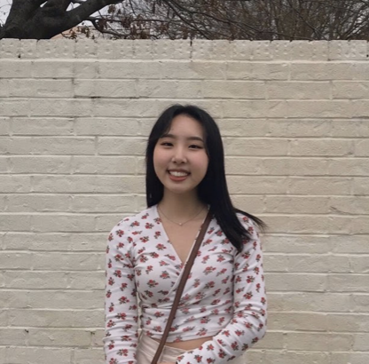

<PageDescription>

Rosa Lee 이주연

</PageDescription>

<Tabs>

<Tab label="한국어">
소개

  Q: 이름

A: 이주연

  Q: 학년 및 전공

A: 2학년 심리학/의예과 (준비)

  Q: 이 전공을 선택한 이유는?

A: 심리학을 공부하면 환자들의 정신적 심정까지 잘 이해할수 있고 환자와의 더 정확한 의사소통을 할 수 있는 데에 도움이 될 것 같아서 이 전공을 선택함. 또한, 고등학교때 AP Psych에 흥미가 있었음

  Q: 내 자신을 어떻게 묘사하는지?

A: 음… 사람 만나는 것 좋아하는 집순이?

  Q: 별명이 있는지?

A: 있지, 제일 기억에 남는 것 하나 뽑자면 고사리…

  Q: 원하는 성격이 있다면?

A: 꾸준히 연락을 잘 하는 성격을 가진 사람

  Q: 노래방 18번은?

A: 딱히 18번은 없는데 노래방 가면 친구들이랑 옛날 노래 부르는거 좋아해. 굳이 뽑자면… 낭만 고양이, 8282, 이브의 경고, 이런 노래들 같이 약간 스트레스 풀기 좋은 노래!

  Q: 가장 좋아하는 음식은?

A: 다진 마늘, 어떤 음식에 넣어도 맛있어서

  Q: 어렸을때 가장 웃겼던 기억이나 순간은?

A: 어떠한 순간이라고 딱 잘라 말할순 없는데… 어렸을때 팬티를 바지 위에 입는 것 좋아해가지고 그렇게 입고 밖에 돌아다녔던 기억이…

  Q: 그때 당시에 몇살이였는지?

A: 유치원 다닐때..? 더 전일 수도 있고?

  Q: 만약 두개의 초능력을 고를수 있다면, 예를 들어 투명인간이 된다던가
날수있다던가, 어떤 초능력들을 선택할것인지? 선택했다면, 왜 그 초능력들을
골랐는지?

A: 타임슬립. 왜냐면 과거나 미래에도 갈 수 있어서 유용할 것 같아서.

  Q: 마지막으로 누군가에게 준 선물은?

A: Father’s Day에 아빠께 태블릿을 선물해드렸음.

  Q: 만약 무인도에 갇혔다면, 가장 먼저 할 것은?

A: 패닉이 와서 아무것도 못하고 누워서 울듯..?

여름

  Q: 이번 여름 동안 지냈던 곳은?

A: 휴스턴

  Q: 여름 계획/활동

A: 그냥 수업 듣고 취미생활 하면서 지내는 편이고, 가족들이랑 시간을 많이 보내고 친구들도 가끔 만나면서 보냈지.

  Q: 여름 동안의 취미? 요리, 바느질, 독서, 등등

A: 활동적인걸 더 좋아하는데 요즘엔 못돌아다니다 보니 집에서 할 수 있는 것. 영화 보기, 요리하기, 책 읽기, 산책하기, 그리고… DIY 시도하는 중이고 그리고 옛날에 고등학교때 배웠던 불어를 다시 배우는중

  Q: 여름을 어떻게 보내고 싶은지? 바쁘게 아니면 느긋하게?

A: 음… 그냥 이대로 보내려고 하는중

COVID-19

  Q: 코로나는 어떻게 대처하고 있는지?

A: 졸업하면 못보게 되는 부모님하고 언니랑 추억을 더 쌓을 수 있는 기회 그리고 자기개발에 더 집중 할 수 있는 시간이라고 생각하려고 노력중

  Q: 코로나가 당신에게 긍정적인 면 혹은 부정적인 면으로 큰 영향을 미쳤다고
느끼는지?

A: 솔직히 긍정적인 것들 보다 부정적인게 더 많겠지..? 몇가지 예를 들자면, 일상생활을 할 수 없고 친구들도 자주 못 만나고 그리고 학교 생활을 제대로 못하고. 근데 제일 아쉬운게 일학년 생활이 짧아졌던게 제일 슬픈것 같아 왜냐하면 그때 제일 재밌게 놀 수 있는 시기라고 생각 되어가지고…

  Q: 코로나 사태로 인해 영향을 받은 계획들이 있는지? 있다면, 그것대신
무엇을 계획하고 있는지?

A: 원래 인턴십 같은거 하려고 했는데 못 하게 되어서 그냥 집에서 몇가지 수업 들으면서 뒹굴뒹굴 있는중

  Q: COVID-19사태에도 불구하고, 다음 학기에 이루고 싶은 목표나 바라는
소망이 있는지?

A: 다음 학기에는 아무래도 의예과에 진학하는것에 목표를 두고 있어서 진학하기 위해 해야하는 것들을 하고싶어. 예를 들어, 지금 하지 못하는 것들? (병원 봉사, 인턴십)

  Q: COVID-19으로 인해 배운 가장 큰 교훈은?

A: 어… 너무 많은데. 제일 신기한 건 어떤 사람들은 마스크를 제대로 쓰는 법도 모른다.

UT & COVID-19

  Q: 강의들이 어떻게 진행되었으면 하는지? 대면강의가 좋을지 아니면 전부
비대면 강의가 좋을지?

A: 당연히 온라인이지. 코로나 걸리기 싫음.

  Q: 한학기동안 어디에 있을 것인가에 대한 걱정이 있는지? (집에 계속
머무를지, 아님 캠퍼스로로 올지)

A: 없어요.

  Q: 다음학기 들을 수업들과 생활적인 면에 대해 긍정적인 점이 있는지?

A: 아무래도 집에서 생활하니까 공부에 더 집중 할 수 있다는 게 좋은 것 같아

  Q: 이제 캠퍼스 대신 집에 있으니, 집에서 지내는게 뭐가 좋은지?

A: 아 딱히 좋은건 아예 없는데 허허… 캠퍼스에 있고싶죠

수업

  Q: 어떤 수업들을 듣고 있는지?

A: 전공 pre-requisites랑 pre-med 수업들.

  Q: 전부 대면수업 혹은 비대면수업인지? 아니면 섞여서 듣고있는지?

A: 다 온라인

  Q: 이번 신청한 수업들 중에서 기대되는 수업이 혹시 있는지?

A: MUS307

  Q: 제일 듣기 싫은 수업이 혹시 있는지?

A: 오켐 당연히.

인터뷰를 마치며

  Q: 최근에 좋은 일들이 있었는지?

A: 초등학교때 있었던 닌텐도를 찾았던거

  Q: 기대하고 있는것들이 있다면?

A: 내년에 상황이 좋아지면 여행을 많이 하고 싶고… 되도록 한국이나 음… 유럽? 어디든 좋을듯

  Q: 대학의 코로나 사태에 대한 조치들에 대해 하고 싶은 메세지가 있다면?

A: 대학이 모든 수업들을 학생들에게 다 온라인으로 수강을 할 수 있는 선택권을 줘야한다고 생각해. 왜냐하면 내가 생각하기에는 코로나에 대한 건강 리스크도 크고, 한 두개 대면강의를 듣겠다고 아파트 렌트비에 많은 돈을 지불해야한다는게 상식적으로 말이 안되잖아

  Q: 새로운 신입생들에게 판데믹 사태와 학교 생활에 대해 하고 싶은 메시지가
있다면?

A: 그냥 집에 있어… 돈 아껴야지… 허헛

  Q: 2019년 가을학기부터 2020년 봄학기 까지 가장 기억에 남는 순간이 있다면?

A: 봉준호 감독님 왔을때 되게 충격적이면서 뿌듯한 감정..? 실제로 보진 못했고 스트리밍 되는 방에 갔는데 사람이 가득 차서 복도에 앉아 있었던게 기억에 제일 남을듯?

</Tab>

<Tab label="English">

Introduction

  Q: What’s your name?

A: Rosa Lee

  Q: What is your year and major?

A: 2nd-year psychology slash pre-med I guess.

  Q: Why did you choose this major?

A: I chose this major because I thought it would help me to communicate with patients more accurately because I can understand their mental feelings well. Also, I enjoyed studying AP Psych during high school.

  Q: How do you describe yourself?

A: Uh… that’s so hard… A homebody who likes to socialize.

  Q: Do you have any nicknames?

A: I have some, but the most memorable one is 고사리

  Q: What personality trait do you wish you had?

A: Someone who’s good at keeping up with others.

  Q: What’s your go-to song at Karaoke place?

A: I don’t really have a specific go-to song but when I go to karaoke I like singing old songs with my friends.

  Q: What is your favorite food?

A: Minced garlic because it goes good with everything.

  Q: Any funniest childhood memory/experience?

A: This isn’t a specific moment, but when I was younger I liked to wear my underwear on top of my pants and went out in public like that.

  Q: How old were you in that situation?

A: During kindergarten..? Or maybe younger.

  Q: If you had a choice between two superpowers, being invisible or
flying, what would you choose and why?

A: Time travel. I think it’ll be useful to go the past or the future

  Q: What was the last gift you gave to someone?

A: On Father’s Day I gifted a tablet.

  Q: If you were placed on a deserted island, what would be the first thing
you would do?

A: I think I would lay down and cry because I would be mind blown..?

SUMMER

  Q: Where have you been staying for this summer?

A: Houston

  Q: Summer plans/activities

A: I’ve just been taking a class and doing hobbies, spending lots of time with family, sometimes meeting my friends for this summer.

  Q: Hobbies over the summer? Cooking, sewing, reading, etc?

A: I prefer to be more active but since I can’t go outside, just things I can do at home. Watching movies, cooking, reading, taking walks, and… trying DIY. I’m also relearning French which I learned in high school.

  Q: How do you want to spend your summer? Keeping yourself busy or staying
relaxed?

A: Um… I just want to do what I’ve been doing.

COVID-19

  Q: How are you coping with Corona?

A: I’m trying to think of it as a chance to make more memories with my parents and my sister who I won’t be able to see after I graduate. Also, it’s time to focus on self-development.

  Q: Do you feel it has greatly affected you in positive or negative ways?

A: Honestly, there are more negatives than positives. Like, I can’t do many daily routines, I can’t meet my friends as much and I can’t go to school. But the thing that’s sad and sucks the most is that my freshman year got cut short. Freshman year is when you’re supposed to have the most fun…

  Q: What plans did you have that were affected and what are you doing now
instead?

A: I was planning to do an internship but it didn’t work out. I’m just chilling.

  Q: What you hope to accomplish this next semester (any goals/wishes) in
spite of COVID-19

A: During next semester, I think I need to focus on pre-med. Such as volunteering in a hospital or internships. Things I can’t do right now.

  Q: What’s the biggest ‘lesson’ you feel you’ve learned because of
COVID-19?

A: Uh… There are so many. The most interesting one is that some people don’t know how to correctly wear a mask.

UT & COVID-19

  Q: How do you want your courses to be held? All online or in-person?

A: Of course online. I don’t want to get corona.

  Q: Worries about where you will be for the semester? (staying at home, in
an apartment, etc.)

A: No.

  Q: Positives of your class schedule and living situation

A: Since I’ll be at home all the time I think I’ll be able to focus more when studying.

  Q: Now that you’re home instead of on campus, what do you like about
being home?

A: Oh. I don’t like anything. I want to be on campus.

CLASSES

  Q: What classes are you taking?

A: Basically, pre-requisites for my major and courses regarding pre-med

  Q: Are your classes fully online or hybrid, in-class?

A: Yeah, all online.

  Q: Any classes you are excited for or happy you got into?

A: MUS307

  Q: Classes you’re least excited for, if any?

A: Ochem, of course.

CLOSING STATEMENTS

  Q: What good things have happened to you/ in your life lately?

A: I found my Nintendo from elementary school.

  Q: What are some things you’re looking forward to?

A: I’m hoping to travel a lot next year if the situation gets better. Korea and like… I don’t know, Europe? Anywhere would be good.

  Q: Do you have a message for the University and their actions or
inactions with COVID?

A: The university needs to make all classes have an option of being online because I feel like it doesn’t make sense to put your health at risk and pay thousands of dollars for rent just to attend one or two classes in-person.

  Q: What is your message to incoming freshmen considering the pandemic and
college life?

A: Just stay home. Save money.

  Q: What is one of your most memorable moments during Fall 2019 to Spring
2020?

A: When Director Bong Joon Ho came it was shocking and I felt proud at the same time. I didn’t get to see him in real life though. (Went to the streaming room) The room was crowded and we had to sit in the aisle.

</Tab>
</Tabs>

